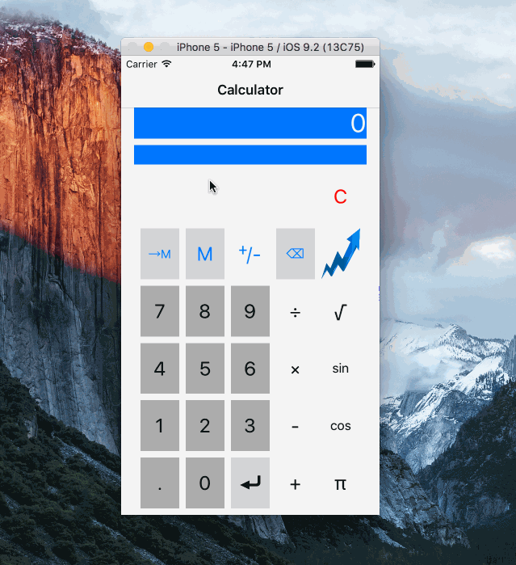
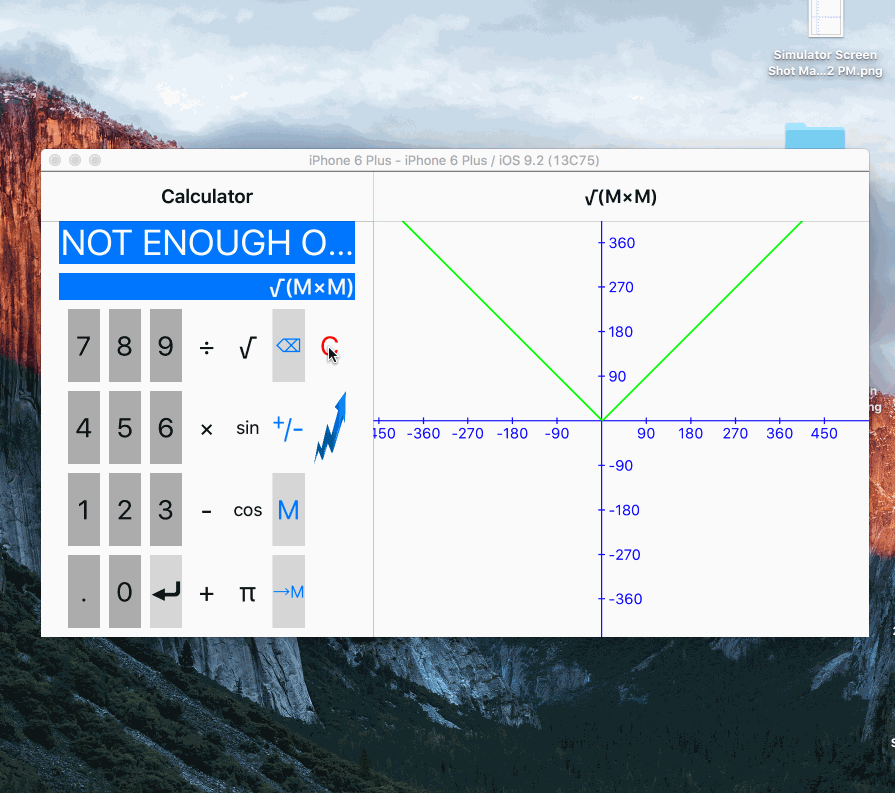

# cs193p-pa3

## Objective
Make a split-view graphing calculator.

## Main tasks
1. [x] You must begin this assignment with your Assignment 2 code, not with any in-class demo code that has been posted. Learning to create new MVCs and segues requires experiencing it, not copy/pasting it or editing an existing storyboard that already has segues in it.
2. [x] Rename the ViewController class you’ve been working on in Assignments 1 and 2 to be CalculatorViewController.
3. [x] Add a new button to your calculator’s user-interface which, when touched, segues to a new MVC (that you will have to write) which graphs the program in the CalculatorBrain at the time the button was touched using the memory location M as the independent variable. For example, if the CalculatorBrain contains sin(M), you’d draw a sine wave. Subsequent input to the Calculator must have no effect on the graph (until the graphing button is touched again).
4. [x] Neither of your MVCs in this assignment is allowed to have CalculatorBrain appear anywhere in its non-private API.
5. [x] On iPad and in landscape on iPhone 6+ devices, the graph must be (or be able to be) on screen at the same time as your existing Calculator’s user-interface (i.e. in a split view). On other iPhones the graph should “push” onto the screen via a navigation controller.
6. [x] Anytime a graph is on screen, a description of what it is being drawn should also be shown on screen somewhere sensible, e.g., if sin(M) is what is being graphed, then the string “sin(M)” should be on screen somewhere.
7. [x] As part of your implementation, you are required write a generic x vs. y graphing UIView. In other words, the UIView that does the graphing should be designed in such a way that it is completely independent of the Calculator (and could be reused in some other completely different application that wanted to draw an x vs. y graph).
8. [x] The graphing view must not own (i.e. store) the data it is graphing. It must use delegation to obtain the data as it needs it.
9. [x] Your graphing calculator must be able to graph discontinuous functions properly (i.e. it must only draw lines to or from points which, for a given value of M, the program being graphed evaluates to a Double (i.e. not nil) that .isNormal or .isZero).
10. [x] Your graphing view must be @IBDesignable and its scale must be @IBInspectable. The graphing view’s axes should appear in the storyboard at the inspected scale.
11. [x] Your graphing view must support the following three gestures:
    a. [x] Pinching (zooms the entire graph, including the axes, in or out on the graph)
    b. [x] Panning (moves the entire graph, including the axes, to follow the touch around)
    c. [x] Double-tapping (moves the origin of the graph to the point of the double tap) 

## Pain points for this assignment AKA "stuff to learn"
Here is a partial list of concepts this assignment is intended to let you gain practice with or otherwise demonstrate your knowledge of.

1. Understanding MVC boundaries
2. Creating a new subclass of UIViewController
3. Universal Application (i.e. different UIs on iPad and iPhone in the same application) Split View Controller
4. Navigation Controller
5. Segues
6. Property List
7. Subclassing UIView
8. UIViewContentMode.Redraw
9. Delegation
10. Drawing with UIBezierPath and/or Core Graphics CGFloat/CGPoint/CGSize/CGRect
11. Gestures
12. contentScaleFactor (pixels vs. points)

## Evaluation
In all of the assignments this quarter, writing quality code that builds without warnings or errors, and then testing the resulting application and iterating until it functions properly is the goal.
Here are the most common reasons assignments are marked down:

  * Project does not build.
  * Project does not build without warnings.
  * One or more items in the Required Tasks section was not satisfied.
  * A fundamental concept was not understood.
  * Code is visually sloppy and hard to read (e.g. indentation is not consistent, etc.).
  * Yoursolutionisdifficult(orimpossible)forsomeonereadingthecodeto understand due to lack of comments, poor variable/method names, poor solution structure, long methods, etc.
  * UI is a mess. Things should be lined up and appropriately spaced to “look nice.”
  * Public and private API is not properly delineated.

## Extra Credit
1. [ ] Figure out how to use Instruments to analyze the performance of panning and pinching in your graphing view. What makes dragging the graph around so sluggish? Explain in comments in your code what you found and what you might do about it.
2. [ ] Use the information you found above to improve panning performance. Do NOT turn your code into a mess to do this. Your solution should be simple and elegant. There is a strong temptation when optimizing to sacrifice readability or to violate MVC boundaries, but you are NOT allowed to do that for this Extra Credit!

Did not do 1 and 2.  Upon reading this, I just pre-emptively did the solution of over-graphing the graph.  That is, instead of graphing just the viewport, I would graph 5 times the width of the viewport.  Upon panning, I would not calculate data but instead just regraph the data I already had.  This proves to be pretty smooth and not laggy at all.

3. [x] Preserve origin and scale between launchings of the application. Where should this be done to best respect MVC, do you think?

Just did this in GraphView--makes no sense to do it elsewhere since the View owns what a scale and where and origin should be placed in the view...

4. [x] Upon rotation (or any bounds change), maintain the origin of your graph with respect to the center of your graphing view rather than with respect to the upper left corner.
5. [ ] Add a popover to your new MVC that reports the minimum and maximum y-value (and other stats if you wish) in the region of the graph currently being shown. This will require you to create yet another new MVC and segue to it using a popover segue. It will also require some new public API in your generic graph view to report stats about the region of the graph it has drawn.

Nah.

6. [x] Have your Calculator react to size class changes by laying out the user-interface differently in different size class environments (i.e. buttons in a different grid layout or even add more operations in one arrangement or the other). Doing this must not break anything else!

##Demos and so forth
First recording is just a basic recap of the assignment:  I graph some constant.  I graph some trivial function.  Then, I graph a non-contiguous function.  

Second gif is the extra credit where I show that the origin is rotated relative to the center.  I also stop/start the program to show that scale and origin is preserved.  Note that during rotation the keys in the calculators are re-arranged, as per extra credit.  

##What could be better?
  * I wonder if there is an automatic way to pick the scale of X given the equation; that would be neat.  For example, a "sin" wave with a 2pi frequency could automatically pick -pi to pi.
  * I hardcoded "M" for the variable value to graph.  There really ought to be a constants definition somewhere either included in some sort of ".d" or a package-wide constant enum that could be called.
  * Zero-sampling is bad.  For things like 1/M, I graph a line here between what's supposed to be -inf to +inf.  However, since I'm samplying floats in the window I care about, I reckon M is sampled as "a very small negative number" and then "a very small positive number"--neither of which are exactly 0.  Thus, in the sampling space, everything is legitimate and finite.  A solution I could think of is during sampling, force a sample point at 0 if we cross the negative-to-positive border.
  * For high-frequency sines or anything that requires a lot of detail in a small space, there is a lot of bad aliasing going on.  The sample size, of say, something that is 100xsin(8xMxpi) over a span of 400 in the x-axis looks pretty bad.  The peaks in each wave is different even though they obviously should not be.  I am already sampling one point per Point in the window; perhaps I ought to sample multiple points per Point for a more dense drawing.
  * Had some weird EXC BAD ACCESS stuff for a while, but after stopping the calculator and playing around with the scale, some how that error disappeared--my code didn't change at all.  Wonder what happened there.
  * Axes, when moved out of view ought to really stay in the edge of the screen.  Once you move an axis or both axes out of the screen, everything you look at is gibberish.  An axes that will "clip" to an edge and also a grid system would be much better (easier to tell what the values are).

Fixing these (except for the last one) is left as an exercise for the reader.
